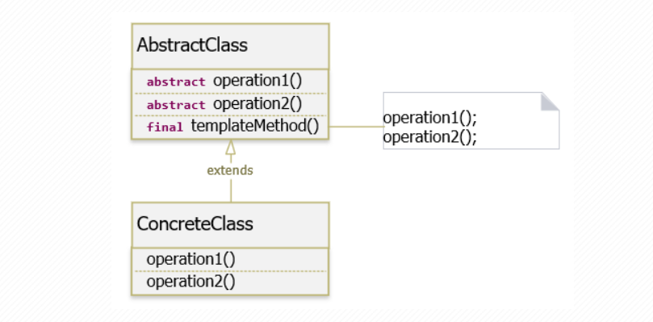

### Template Method Pattern
- Là một trong những Pattern thuộc nhóm hành vi (Behavior Pattern). 
- Pattern này nói rằng “Định nghĩa một bộ khung của một thuật toán trong một chức năng, chuyển giao việc thực hiện nó cho các lớp con. 
- Mẫu Template Method cho phép lớp con định nghĩa lại cách thực hiện của một thuật toán, mà không phải thay đổi cấu trúc thuật toán“.
### Cấu trúc của Template Method Pattern

#### Các thành phần tham gia Template Method Pattern:
#### AbstractClass :
+ Định nghĩa các phương thức trừu tượng cho từng bước có thể được điều chỉnh bởi các lớp con.
+ Cài đặt một phương thức duy nhất điều khiển thuật toán và gọi các bước riêng lẻ đã được cài đặt ở các lớp con.
#### ConcreteClass : 
+ Là một thuật toán cụ thể, cài đặt các phương thức của AbstractClass. 
+ Các thuật toán này ghi đè lên các phương thức trừu tượng để cung cấp các triển khai thực sự. Nó không thể ghi đè phương thức duy nhất đã được cài đặt ở AbstractClass (templateMethod).